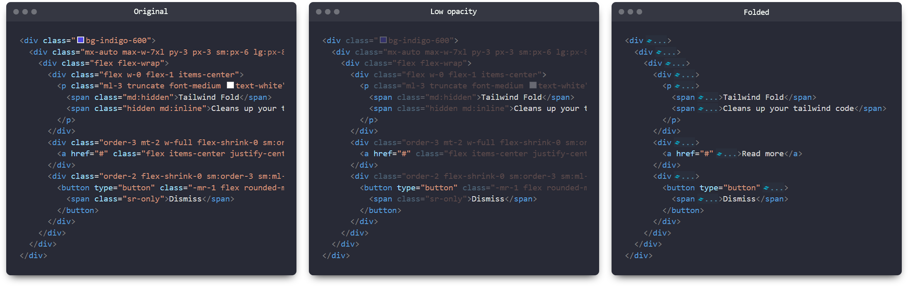
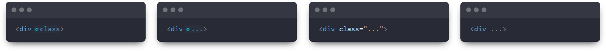
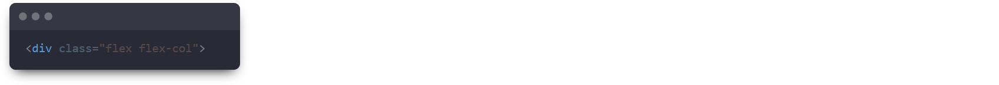

# Tailwind Fold

With Tailwind Fold, you can say goodbye to messy and hard-to-read HTML code. This extension helps improve the readability of your code by automatically "folding" long class attributes.

## Features

By default, automatic folding is enabled, but you can customize this behavior in the settings. Quickly toggle folding using the keyboard shortcut `Ctrl+Alt+A`

### Comparison

### Customizable folding styles

### Customizable opacity of unfolded class attributes

## Extension Settings

This extension contributes the following settings:

-   `tailwind-fold.autoFold`: Enable/disable automatic class attribute folding
-   `tailwind-fold.foldStyle`: Defines folding style
-   `tailwind-fold.unfoldIfLineSelected`: Unfolds class attributes if line is selected
-   `tailwind-fold.showTailwindImage`: Show/hide the tailwind logo infront of folded content
-   `tailwind-fold.foldedText`: Text to show when class attributes are folded
-   `tailwind-fold.foldedTextColor`: Color of the text when folded
-   `tailwind-fold.foldedTextBackgroundColor`: Background color of the text when folded
-   `tailwind-fold.unfoldedTextOpacity`: Opacity of unfolded class attributes
-   `tailwind-fold.supportedLanguages`: Array of languages the extension is enabled for
-   `tailwind-fold.foldLengthThreshold`: Specifies the minimum number of classes required for a section to be unfolded instead of folded.

## Note

This extension folds all class attributes, even if there are no tailwind specific attributes.
